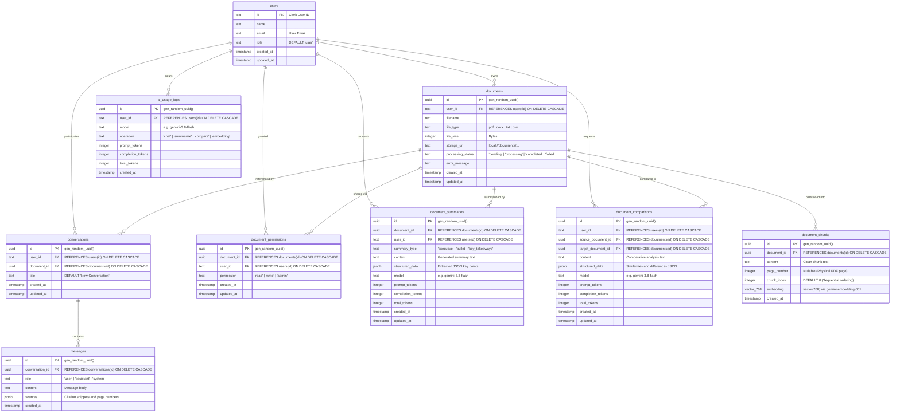

# DocuMind — Database Schema, ERD & Migration Architecture

This document provides the authoritative specification of DocuMind's relational schema, vector storage columns, indexing strategy, and database migration pipeline.

---

## 1. Entity-Relationship Diagram (ERD)

DocuMind maintains **9 application tables** in PostgreSQL managed through Drizzle ORM (`src/db/schema.js`). All relationships between child entities and parent users/documents enforce cascade deletion (`ON DELETE CASCADE`).



---

## 2. Table Dictionaries & Specifications

### 2.1 `users` Table
Stores authenticated user records synchronized from Clerk sessions.
* `id` (`text`, PRIMARY KEY): Clerk user ID (e.g. `user_2tQ...`).
* `name` (`text`, NULLABLE): User display name.
* `email` (`text`, NOT NULL): User email address.
* `role` (`text`, NOT NULL, DEFAULT `'user'`): Authoritative authorization role (`'user'` or `'admin'`).
* `created_at` (`timestamp`, NOT NULL, DEFAULT `now()`).
* `updated_at` (`timestamp`, NOT NULL, DEFAULT `now()`).

### 2.2 `documents` Table
Stores document records, processing status, and storage references.
* `id` (`uuid`, PRIMARY KEY, DEFAULT `gen_random_uuid()`).
* `user_id` (`text`, NOT NULL): Foreign key referencing `users(id)` ON DELETE CASCADE.
* `filename` (`text`, NOT NULL): Original uploaded filename.
* `file_type` (`text`, NOT NULL): Document MIME/format category (`pdf`, `docx`, `txt`, `csv`).
* `file_size` (`integer`, NOT NULL): File size in bytes (max 20,971,520 bytes).
* `storage_url` (`text`, NOT NULL): Relative local storage reference (`local://documents/...`).
* `processing_status` (`text`, NOT NULL, DEFAULT `'pending'`): Ingestion status (`pending`, `processing`, `completed`, `failed`).
* `error_message` (`text`, NULLABLE): Descriptive error message if processing failed.
* `created_at` (`timestamp`, NOT NULL, DEFAULT `now()`).
* `updated_at` (`timestamp`, NOT NULL, DEFAULT `now()`).

### 2.3 `document_chunks` Table
Stores partitioned document text and 768-dimensional embeddings.
* `id` (`uuid`, PRIMARY KEY, DEFAULT `gen_random_uuid()`).
* `document_id` (`uuid`, NOT NULL): Foreign key referencing `documents(id)` ON DELETE CASCADE.
* `content` (`text`, NOT NULL): Chunk text content.
* `page_number` (`integer`, NULLABLE): Physical PDF page number (null for non-paginated files).
* `chunk_index` (`integer`, NOT NULL, DEFAULT `0`): Sequential ordering index.
* `embedding` (`vector(768)`, NULLABLE): Vector embedding generated by `gemini-embedding-001`.
* `created_at` (`timestamp`, NOT NULL, DEFAULT `now()`).

### 2.4 `conversations` Table
Maintains multi-turn conversational chat sessions.
* `id` (`uuid`, PRIMARY KEY, DEFAULT `gen_random_uuid()`).
* `user_id` (`text`, NOT NULL): Foreign key referencing `users(id)` ON DELETE CASCADE.
* `document_id` (`uuid`, NULLABLE): Foreign key referencing `documents(id)` ON DELETE CASCADE.
* `title` (`text`, NOT NULL, DEFAULT `'New Conversation'`).
* `created_at` (`timestamp`, NOT NULL, DEFAULT `now()`).
* `updated_at` (`timestamp`, NOT NULL, DEFAULT `now()`).

### 2.5 `messages` Table
Maintains chronological turns of dialogue within a conversation.
* `id` (`uuid`, PRIMARY KEY, DEFAULT `gen_random_uuid()`).
* `conversation_id` (`uuid`, NOT NULL): Foreign key referencing `conversations(id)` ON DELETE CASCADE.
* `role` (`text`, NOT NULL): Message sender role (`'user'`, `'assistant'`, `'system'`).
* `content` (`text`, NOT NULL): Message text content.
* `sources` (`jsonb`, NULLABLE): Array of citation objects containing passage snippets and page numbers.
* `created_at` (`timestamp`, NOT NULL, DEFAULT `now()`).

### 2.6 `document_permissions` Table
Enforces collaborator sharing and granular access control.
* `id` (`uuid`, PRIMARY KEY, DEFAULT `gen_random_uuid()`).
* `document_id` (`uuid`, NOT NULL): Foreign key referencing `documents(id)` ON DELETE CASCADE.
* `user_id` (`text`, NOT NULL): Foreign key referencing `users(id)` ON DELETE CASCADE.
* `permission` (`text`, NOT NULL, DEFAULT `'read'`): Access role (`'read'`, `'write'`, `'admin'`).
* `created_at` (`timestamp`, NOT NULL, DEFAULT `now()`).
* `updated_at` (`timestamp`, NOT NULL, DEFAULT `now()`).

### 2.7 `ai_usage_logs` Table
Maintains platform-wide AI token and model consumption telemetry.
* `id` (`uuid`, PRIMARY KEY, DEFAULT `gen_random_uuid()`).
* `user_id` (`text`, NOT NULL): Foreign key referencing `users(id)` ON DELETE CASCADE.
* `model` (`text`, NOT NULL): Model name (e.g. `gemini-3.8-flash`, `gemini-embedding-001`).
* `operation` (`text`, NOT NULL): AI operation type (`'chat'`, `'summarize'`, `'compare'`, `'embedding'`).
* `prompt_tokens` (`integer`, NULLABLE): Input token count.
* `completion_tokens` (`integer`, NULLABLE): Output token count.
* `total_tokens` (`integer`, NULLABLE): Combined token count.
* `created_at` (`timestamp`, NOT NULL, DEFAULT `now()`).

### 2.8 `document_summaries` Table
Caches generated document summaries to eliminate redundant AI calls.
* `id` (`uuid`, PRIMARY KEY, DEFAULT `gen_random_uuid()`).
* `document_id` (`uuid`, NOT NULL): Foreign key referencing `documents(id)` ON DELETE CASCADE.
* `user_id` (`text`, NOT NULL): Foreign key referencing `users(id)` ON DELETE CASCADE.
* `summary_type` (`text`, NOT NULL): Category (`'executive'`, `'bullet'`, `'key_takeaways'`).
* `content` (`text`, NOT NULL): Summary text.
* `structured_data` (`jsonb`, NULLABLE): Extracted structured key points.
* `model` (`text`, NOT NULL): Model used (`gemini-3.8-flash`).
* `prompt_tokens`, `completion_tokens`, `total_tokens` (`integer`, NULLABLE): Token usage.
* `created_at`, `updated_at` (`timestamp`, NOT NULL, DEFAULT `now()`).

### 2.9 `document_comparisons` Table
Caches comparative analysis between two authorized documents.
* `id` (`uuid`, PRIMARY KEY, DEFAULT `gen_random_uuid()`).
* `user_id` (`text`, NOT NULL): Foreign key referencing `users(id)` ON DELETE CASCADE.
* `source_document_id` (`uuid`, NOT NULL): Foreign key referencing `documents(id)` ON DELETE CASCADE.
* `target_document_id` (`uuid`, NOT NULL): Foreign key referencing `documents(id)` ON DELETE CASCADE.
* `content` (`text`, NOT NULL): Comparative analysis markdown.
* `structured_data` (`jsonb`, NULLABLE): Extracted structured similarities and differences.
* `model` (`text`, NOT NULL): Model used (`gemini-3.8-flash`).
* `prompt_tokens`, `completion_tokens`, `total_tokens` (`integer`, NULLABLE): Token usage.
* `created_at`, `updated_at` (`timestamp`, NOT NULL, DEFAULT `now()`).

---

## 3. Database Indexes & Vector Optimization Catalog

Across migrations `0000` through `0007`, the following indexes were established to optimize query performance and enforce uniqueness:

| Index Name | Table | Columns | Type / Purpose |
| :--- | :--- | :--- | :--- |
| `document_chunks_doc_chunk_idx` | `document_chunks` | `(document_id, chunk_index)` | B-Tree: Deterministic chunk ordering and retrieval. |
| `ai_usage_logs_user_created_idx` | `ai_usage_logs` | `(user_id, created_at)` | B-Tree: User-scoped telemetry time-series lookups. |
| `ai_usage_logs_op_created_idx` | `ai_usage_logs` | `(operation, created_at)` | B-Tree: Admin telemetry filtering by AI operation. |
| `messages_conversation_created_idx`| `messages` | `(conversation_id, created_at)`| B-Tree: Chronological message history retrieval. |
| `conversations_user_updated_idx` | `conversations` | `(user_id, updated_at)` | B-Tree: Recent conversation listing sorting. |
| `conversations_user_created_idx` | `conversations` | `(user_id, created_at)` | B-Tree: Historical conversation query performance. |
| `doc_summaries_doc_type_uniq_idx` | `document_summaries` | `(document_id, summary_type)` | **UNIQUE**: Prevents duplicate summaries per document. |
| `doc_summaries_user_created_idx` | `document_summaries` | `(user_id, created_at)` | B-Tree: User summary listing performance. |
| `doc_summaries_doc_idx` | `document_summaries` | `(document_id)` | B-Tree: Fast summary resolution during document view. |
| `doc_comparisons_pair_uniq_idx` | `document_comparisons`| `(source_document_id, target_document_id)` | **UNIQUE**: Prevents duplicate comparisons for pairs. |
| `doc_comparisons_user_created_idx` | `document_comparisons`| `(user_id, created_at)` | B-Tree: User comparison listing performance. |
| `doc_comparisons_source_idx` | `document_comparisons`| `(source_document_id)` | B-Tree: Invalidation lookup on source document update. |
| `doc_comparisons_target_idx` | `document_comparisons`| `(target_document_id)` | B-Tree: Invalidation lookup on target document update. |
| `doc_permissions_doc_user_uniq_idx`| `document_permissions`| `(document_id, user_id)` | **UNIQUE**: Enforces single permission record per pair. |
| `doc_permissions_user_idx` | `document_permissions`| `(user_id)` | B-Tree: Fast lookup of shared documents for user. |
| `doc_permissions_doc_idx` | `document_permissions`| `(document_id)` | B-Tree: Fast collaborator resolution during sharing view. |
| `users_role_idx` | `users` | `(role)` | B-Tree: Fast administrator role lookups and locks. |
| `documents_status_created_idx` | `documents` | `(processing_status, created_at)`| B-Tree: Admin processing queue and failure monitoring. |
| `documents_created_idx` | `documents` | `(created_at)` | B-Tree: Document upload trend analytics. |

---

## 4. Migration History & Execution Workflow

### 4.1 Authoritative Migration Sequence (0000–0007)
All migrations are stored in `./drizzle/` and tracked in the PostgreSQL table `__drizzle_migrations`:
* **`0000_tranquil_dormammu.sql`:** Creates the `vector` extension (`CREATE EXTENSION IF NOT EXISTS vector;`), creates initial tables (`conversations`, `document_chunks` with `embedding vector(768)`, `document_permissions`, `documents`, `messages`, `users`), and establishes cascade foreign keys.
* **`0001_eager_dormammu.sql`:** Adds `chunk_index` (integer, DEFAULT 0, NOT NULL) to `document_chunks` and creates index `document_chunks_doc_chunk_idx`.
* **`0002_add_ai_usage_logs.sql`:** Creates `ai_usage_logs` table, foreign key constraint to `users(id)`, and index on `(user_id, created_at)`.
* **`0003_add_conversation_history_indexes.sql`:** Creates performance indexes on `messages(conversation_id, created_at)`, `conversations(user_id, updated_at)`, and `conversations(user_id, created_at)`.
* **`0004_add_document_summaries.sql`:** Creates `document_summaries` table with unique constraint on `(document_id, summary_type)` and performance query indexes.
* **`0005_add_document_comparisons.sql`:** Creates `document_comparisons` table with unique constraint on `(source_document_id, target_document_id)` and performance query indexes.
* **`0006_enhance_document_permissions.sql`:** Deterministically cleans duplicate permissions (`PARTITION BY document_id, user_id` retaining write over read), adds `updated_at`, unique constraint on `(document_id, user_id)`, and query indexes.
* **`0007_add_admin_indexes.sql`:** Creates administrative indexes on `users(role)`, `documents(processing_status, created_at)`, `documents(created_at)`, and `ai_usage_logs(operation, created_at)`.

### 4.2 Production Migration Execution Protocol
* **Authoritative Production Command:**
  ```bash
  npm run db:migrate
  ```
  This command executes `node src/db/migrate.js`, using `drizzle-orm/postgres-js/migrator` to read `./drizzle` and apply pending forward-only migrations atomically.
* **Prohibition of `drizzle-kit push`:**
  `drizzle-kit push` is strictly prohibited in production environments. It bypasses migration files and can execute destructive table alterations or silent data drops.
