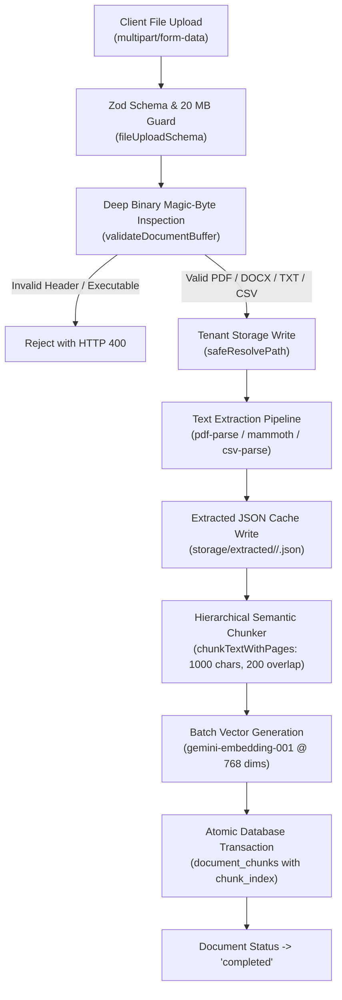
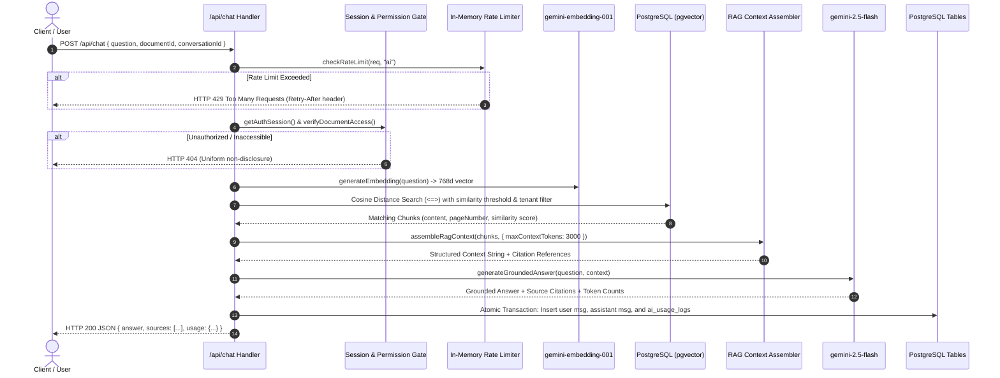
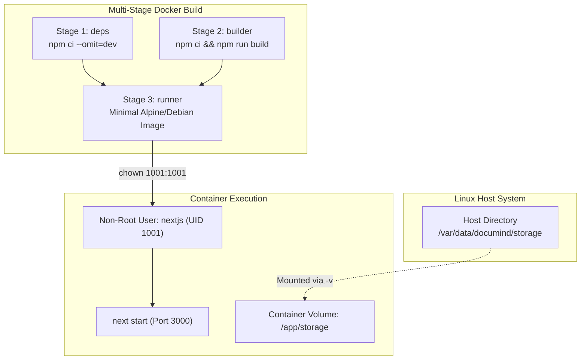

# DocuMind — System Architecture & Technical Specification

This document provides an in-depth technical analysis of DocuMind's architectural patterns, data pipelines, lifecycle flows, and infrastructure design.

---

## 1. Architectural Foundations & Invariants

DocuMind is built upon six foundational architectural decisions:

1. **100% Pure JavaScript:** The entire application (Next.js 14 App Router, server route handlers, background processors, test suites, and deployment scripts) runs on Node.js 20 LTS as pure ESM/CommonJS JavaScript (`.js`, `.jsx`, `.mjs`). Zero TypeScript compilers or type-checking build steps are utilized.
2. **PostgreSQL + pgvector as the Unified Source of Truth:** Rather than maintaining a separate vector database (e.g., Pinecone, Weaviate) alongside a relational database, DocuMind leverages PostgreSQL 15/16 with the `pgvector` extension. Document metadata, user permissions, conversation history, and 768-dimensional chunk embeddings reside in a single relational store, guaranteeing atomic transactions (`db.transaction`) and foreign-key cascade deletes (`ON DELETE CASCADE`).
3. **Google Gemini Free-Tier Constraint:** All AI operations rely on official Google Gemini free-tier endpoints (`@google/genai`):
   * **Vector Embeddings:** `gemini-embedding-001` with `outputDimensionality: 768`.
   * **Grounded Chat, Summaries & Comparisons:** `gemini-2.5-flash`.
   * *Trade-off:* Free-tier quotas are governed by Google policies. To manage burst traffic locally, DocuMind enforces an application-level sliding-window rate limiter (10 req/min/IP on AI routes) and automatic exponential backoff retries (1s, 2s, 4s) on HTTP 429 events.
4. **Persistent Local Filesystem Storage:** Document binaries and extracted text JSON persist on the local filesystem under `/app/storage/documents` and `/app/storage/extracted`. In production, this directory is mounted to a persistent host disk via Docker volume (`-v /var/data/documind/storage:/app/storage`), eliminating external cloud object storage costs.
5. **Database-Authoritative Admin Authorization:** While Clerk authentication establishes caller identity (`userId`), PostgreSQL `users.role === 'admin'` is the sole authoritative administrative authority. Every admin endpoint (`/api/admin/*`) executes a live database query (`verifyAdminAccess`), eliminating vulnerability to stale JWT session claims.
6. **Multi-Tenant Boundary & IDOR Defense:** All queries enforce user ownership or verified document permissions (`verifyDocumentAccess`, `verifyDualDocumentAccess`). Unauthorized or nonexistent documents return a uniform HTTP 404 response to prevent IDOR existence probing.

---

## 2. Document Ingestion & Vectorization Pipeline

The document ingestion pipeline transforms raw uploaded files into clean, searchable, 768-dimensional vector chunks.



### Ingestion Stages:
1. **Request Validation:** The upload handler (`src/app/api/documents/upload/route.js`) enforces a strict 20 MB maximum size limit (`MAX_FILE_SIZE = 20 * 1024 * 1024`).
2. **Deep Magic-Byte Validation (`validateDocumentBuffer`):**
   * **PDF:** Asserts initial buffer bytes match `%PDF-`.
   * **DOCX:** Asserts initial buffer bytes match `PK\x03\x04` and verifies the presence of `[Content_Types].xml` or `word/` directory entries.
   * **TXT:** Validates UTF-8 encoding and asserts zero binary null bytes (`\0`).
   * **CSV:** Validates parseable tabular structure (including valid single-column CSVs) and rejects null-byte injections.
   * *Security Rule:* Detects and rejects Windows PE (`MZ`), Linux ELF (`\x7fELF`), and Mach-O executables disguised with document extensions.
3. **Sandboxed Storage Write (`saveFile`):**
   * Creates an isolated tenant directory: `/app/storage/documents/<sanitizedUserId>/`.
   * Generates a UUID-prefixed safe filename: `<uuid>-<sanitizedBasename>.<ext>`.
   * Validates path containment via `safeResolvePath` to prevent directory traversal.
4. **Multi-Format Text Extraction:**
   * **PDF:** Parsed using `pdf-parse`. Accurately records genuine physical page numbers (`pageNumber: 1..N`) for every extracted page.
   * **DOCX:** Extracted via `mammoth` into clean raw text.
   * **TXT:** UTF-8 text parsed directly with line and word statistics.
   * **CSV:** Parsed using `csv-parse/sync` into formatted tabular representations.
   * Caches raw extracted text as JSON in `/app/storage/extracted/<sanitizedUserId>/<docId>.json`.
5. **Hierarchical Semantic Chunking (`chunkTextWithPages`):**
   * Breaks text into semantic chunks (~1000 characters) with a 200-character sliding overlap.
   * Preserves genuine physical page attribution for PDFs (`pageNumber`) while setting `pageNumber: null` for non-paginated formats (DOCX, TXT, CSV).
   * Assigns sequential `chunk_index` values (0, 1, 2...) for strict deterministic ordering.
6. **Vector Embedding Generation (`generateEmbeddingBatch`):**
   * Batches chunk texts and invokes `gemini-embedding-001` with `outputDimensionality: 768`.
   * Asserts that every returned vector contains exactly 768 float values before database insertion.
7. **Atomic Persistence:**
   * In a single PostgreSQL transaction (`db.transaction`), chunks are inserted into `document_chunks`, and the document status is updated to `completed`.

---

## 3. Grounded RAG Retrieval & Conversational Pipeline

The Retrieval-Augmented Generation (RAG) pipeline answers user queries using only the verified content of authorized documents.



### Retrieval & Generation Stages:
1. **Burst Rate Limiting:** Enforces an in-memory sliding-window check (10 req/min/IP).
2. **Access Control:** Verifies caller identity and validates that the requesting user owns or has collaborator permissions for the target document.
3. **Query Vectorization:** Generates a 768-dimensional query vector using `gemini-embedding-001`.
4. **Cosine Similarity Search:**
   * Executes a parameterized pgvector cosine distance query:
     ```sql
     SELECT id, content, page_number, 1 - (embedding <=> ${queryVector}) AS similarity
     FROM document_chunks
     WHERE document_id = ${documentId}
       AND (1 - (embedding <=> ${queryVector})) >= ${threshold}
     ORDER BY embedding <=> ${queryVector} ASC
     LIMIT ${topK};
     ```
   * Enforces similarity thresholding *before* the `LIMIT` clause to exclude irrelevant chunks.
5. **Token-Budgeted Context Assembly (`assembleRagContext`):**
   * Assembles the retrieved passages into a structured prompt context while tracking estimated token budgets (default: 3,000 tokens).
   * Truncates gracefully if passages exceed budget, preserving the highest-similarity chunks.
6. **Grounded Generation (`generateGroundedAnswer`):**
   * Directs `gemini-2.5-flash` with strict system instructions to rely exclusively on the provided context.
   * If retrieved context is insufficient, returns a standardized fallback message rather than hallucinating an answer.
7. **Atomic Persistence & Telemetry Logging:**
   * Within a single database transaction, the user question and assistant answer are saved to `messages`, updating `conversations.updatedAt`.
   * Real token counts (`promptTokens`, `completionTokens`, `totalTokens`) are logged to `ai_usage_logs`.

---

## 4. Multi-Document Comparison & Summarization

### 4.1 Document Summarization Pipeline (`/api/documents/:id/summarize`)
* **Formats Supported:** Executive summaries, bulleted highlights, and structured key takeaways.
* **Database Caching:** Summaries are cached in the `document_summaries` table indexed on `(document_id, summary_type)`. If a summary already exists, it is returned immediately without invoking Gemini, preventing duplicate quota consumption.
* **Cache Invalidation:** When a document is re-processed or deleted, associated summaries are automatically purged.

### 4.2 Document Comparison Pipeline (`/api/documents/compare`)
* **Dual-Document Authorization:** Requires caller to have verified read or owner access to *both* the source and target documents (`verifyDualDocumentAccess`). If either document is inaccessible, returns HTTP 404.
* **Structured Analysis:** Uses `gemini-2.5-flash` to extract structured comparisons: similarities, key differences, and actionable recommendations.
* **Database Caching:** Cached in `document_comparisons` indexed on `(source_document_id, target_document_id)`.

---

## 5. Storage Subsystem & Directory Layout

DocuMind uses isolated filesystem storage structured outside the web server's public root:

```text
/app/storage/
├── documents/                               # Raw uploaded binaries
│   ├── user_2tQ.../                         # Sanitized Clerk User ID
│   │   ├── 3f1e9a42-...-financial_report.pdf
│   │   └── a89b41c0-...-quarterly_metrics.csv
│   └── user_2vR.../
│       └── c10d82e1-...-contract_draft.docx
└── extracted/                               # Parsed text & page mappings (JSON)
    ├── user_2tQ.../
    │   ├── 3f1e9a42-...-financial_report.json
    │   └── a89b41c0-...-quarterly_metrics.json
    └── user_2vR.../
        └── c10d82e1-...-contract_draft.json
```

### Path Traversal Defense (`safeResolvePath`):
Every filesystem operation passes through `safeResolvePath(rootDir, relativePath)`:
1. Rejects null bytes (`\0` and `%00`).
2. Safely decodes URI percent-encoded sequences inside a try/catch block.
3. Resolves the path using `path.resolve(normalizedRoot, decoded)`.
4. Asserts that the resolved path starts strictly with `normalizedRoot + path.sep`.
5. Resolves symlinks via `fs.realpathSync` to guarantee symlinks do not escape the root directory.

---

## 6. Docker Container Architecture & Deployment

DocuMind deploys as a standalone container built from an official Debian-based runtime (`node:20-bookworm-slim`).



### Container Specifications:
* **Base Image:** `node:20-bookworm-slim` (standard glibc compatibility for native modules).
* **Unprivileged User:** Dedicated `nextjs:nodejs` system user (UID 1001 / GID 1001).
* **Volume Mount:** Host directory mounted into container at `/app/storage`.
* **Zero Secret Leakage:** `.dockerignore` strictly excludes `.env*`, `.git`, test runners, and Playwright artifacts.
* **Liveness Probe:** Configured container healthcheck querying `GET /api/health`.
