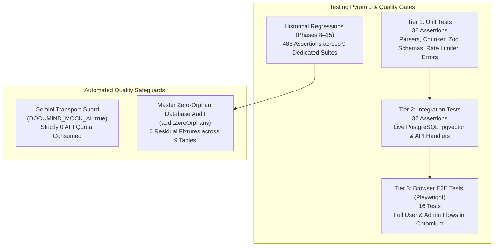

# DocuMind — Testing Strategy, Pyramid & Quality Assurance

This document details DocuMind's 3-tier testing architecture, offline mock transport safeguards, test isolation mechanics, and the authoritative zero-orphan database audit verified in Phase 16.

---

## 1. Testing Philosophy & The 3-Tier Pyramid

DocuMind enforces a rigorous quality pyramid designed to validate correctness, prevent regressions, and ensure zero-leakage test runs.



### Verified Test Check Breakdown:
* **Tier 1 (Unit Tests):** 38 assertions
* **Tier 2 (Integration Tests):** 37 assertions
* **Tier 3 (Browser E2E Tests):** 16 Playwright browser tests
* **Historical Regression Suites (Phases 8–15):** 485 assertions across 9 suites
* **Database Teardown Verification:** 1 master zero-orphan database audit
* **Total Baseline:** **576 verified checks/assertions across the documented test suites**, passing with 100% green status.

---

## 2. Tier 1: Unit Tests (38 Assertions)

* **Script:** `node scripts/tests/unit/run-unit-tests.mjs` (`npm run test:unit`)
* **Scope:** Fast, in-memory validation of isolated utility functions, schemas, and parsers:
  1. *Parsers & Extraction (7 assertions):* TXT extraction, CSV parsing (including single-column CSVs), quoted field parsing, unsupported format handling, non-buffer rejection.
  2. *Semantic Chunker (6 assertions):* Recursive text splitting, index gap prevention, PDF physical page attribution, non-paginated format handling (`pageNumber: null`), chunk overlap continuity.
  3. *Zod Validation Schemas (8 assertions):* 20 MB upload limits, magic-byte checks, chat parameter boundaries, collaborator emails, compare schema rules, admin query coercions.
  4. *In-Memory Rate Limiter (5 assertions):* Identifier resolution, budget decrementing, sliding-window expiry, `Retry-After` calculation, counter reset.
  5. *Storage Path Resolver (5 assertions):* Root boundary containment, raw traversal blocking (`../`), percent-encoded traversal blocking (`%2e%2e`), null-byte rejection.
  6. *Markdown Utilities (3 assertions):* Bold segment parsing, table structure identification, table cell trimming.
  7. *Centralized Error Handling (4 assertions):* Status code mapping, sensitive token scrubbing (`sanitizeLogString`), client error serialization, opaque correlation ID assignment.

---

## 3. Tier 2: Integration Tests (37 Assertions)

* **Script:** `node scripts/tests/integration/run-integration-tests.mjs` (`npm run test:integration`)
* **Scope:** Tests server route handlers against a real PostgreSQL database with `pgvector`:
  1. *Documents API (6 assertions):* Secure disk write, database record creation, chunk foreign-key binding, user data isolation, client-safe field stripping, cascade deletion.
  2. *Vector Search & Cosine Boundaries (4 assertions):* Mathematical boundary vectors (1.0, 0.7071, 0.0, -1.0), 768-dimensional embedding storage in pgvector, monotonic cosine distance ordering (`<=>`), similarity score precision.
  3. *Sharing Permissions (5 assertions):* Owner permissions, uniform 404 for unauthorized callers, read-only vs write enforcement, collaborator promotion, permission revocation.
  4. *Chat & Context (5 assertions):* Conversation session binding, user message persistence, assistant message with citations, AI token logging in `ai_usage_logs`, chronological order.
  5. *Summarization & Comparison (7 assertions):* Summary persistence, cache resolution, invalidation on reprocessing, dual-document access verification, comparison cache invalidation.
  6. *Admin Authorization & Telemetry (4 assertions):* Live `users.role === 'admin'` checks, user directory aggregation, instant promotion reflection.
  7. *Phase 15 Security Invariants (6 assertions):* 20 MB upload constraint, disguised binary rejection, single-column CSV support, path traversal rejection, rate limiting burst throttle, 500 error sanitization.

---

## 4. Tier 3: Browser E2E Tests (16 Playwright Tests)

* **Script:** `npx playwright test` (`npm run test:e2e`)
* **Configuration:** `playwright.config.js` targeting Chromium with Next.js webServer integration.
* **Scope:** Real-browser end-to-end user workflows:
  1. *Authentication & Navigation Gates (6 tests):* Landing page CTA buttons, unauthenticated redirect on `/dashboard`, unauthenticated redirect on `/admin/dashboard`, standard user access to `/dashboard`, standard user blocked from `/admin/dashboard`, admin user access to `/admin/dashboard`.
  2. *Document Ingestion & Viewing (3 tests):* Document listing rendering, upload interface rendering, document detail chunk and metadata inspection.
  3. *Grounded RAG Chat (2 tests):* Chat interface rendering, multi-turn conversation history loading.
  4. *Document Comparison UI (1 test):* Document selector and comparative analysis workspace rendering.
  5. *Document Sharing & Permissions UI (2 tests):* Owner view of owned document, collaborator view of shared document.
  6. *Admin Dashboard & Telemetry Operations (2 tests):* Platform KPI cards and telemetry overview, navigation to user management directory.

---

## 5. Historical Regression Suites (485 Assertions across 9 Suites)

* **Script:** `node scripts/run-regressions.mjs` (`npm run test:regressions`)
* **Purpose:** Ensures that features built during earlier development phases (Phases 8 through 15) remain fully operational without behavioral regressions:
  * Phase 8 (Vector Search Core): 38 assertions
  * Phase 9 (AI Grounded Answering): 42 assertions
  * Phase 9.5 (Hardened Citation Attribution): 28 assertions
  * Phase 10 (Conversation History & Exports): 47 assertions
  * Phase 11 (Document Summarization & Caching): 56 assertions
  * Phase 12 (Document Comparison & Alignment): 64 assertions
  * Phase 13 (Sharing & Granular Permissions): 72 assertions
  * Phase 14 (Admin Dashboard & Monitoring): 72 assertions
  * Phase 15 (Security Hardening & Error Handling): 66 assertions

---

## 6. Offline Mock AI Architecture & Transport Guard

To ensure automated test suites run reliably, deterministically, and with **zero API quota consumption**, DocuMind implements an offline AI transport interceptor:

* **Trigger:** Setting `process.env.DOCUMIND_MOCK_AI = "true"`.
* **Transport Guard (`installGeminiTransportGuard`):** Installs a global `fetch` interceptor in `scripts/tests/utils/mock-ai.js`.
* **Guard Behavior:**
  * Synthesizes mathematically deterministic 768-dimensional float vectors for embeddings.
  * Synthesizes structured grounded responses with citation objects for chat, summarization, and comparison requests.
  * **Fail-Loud Assertion:** If an unmocked network request to `generativelanguage.googleapis.com` is attempted during testing, the transport guard throws an immediate exception, failing the test loudly and preventing unexpected API quota usage.

---

## 7. Database Test Run Isolation & Zero-Orphan Audit

DocuMind enforces absolute database cleanliness between test runs:

* **Unique Test Run Prefix:** Every test run generates a unique run identifier (`test-run-<timestamp>`). All test users, documents, chunks, and conversations are prefixed with this ID.
* **Teardown Hooks:** Every test suite implements automated `try...finally` teardown hooks that delete all fixtures created under that run ID.
* **Authoritative Zero-Orphan Database Audit (`auditZeroOrphans`):**
  At the conclusion of the test run, a dedicated auditing query inspects all 9 application tables for residual test records matching `test-run-*`:
  ```sql
  SELECT COUNT(*) FROM users WHERE id LIKE 'test-run-%';
  SELECT COUNT(*) FROM documents WHERE user_id LIKE 'test-run-%';
  ...
  ```
  The test run fails if any orphaned fixture is detected across any table.

---

## 8. Test Execution Runbook

| Command | Target | Execution Time (Approx.) | Quota Consumed |
| :--- | :--- | :--- | :--- |
| `npm run test:unit` | Tier 1 Unit Tests (38 assertions) | ~1–2 seconds | 0 (Offline) |
| `npm run test:integration` | Tier 2 Integration Tests (37 assertions) | ~3–5 seconds | 0 (Offline) |
| `npm run test:e2e` | Tier 3 Browser E2E Tests (16 tests) | ~60–90 seconds | 0 (Offline) |
| `npm run test:regressions` | Historical Regressions (485 assertions) | ~15–20 seconds | 0 (Offline) |
| `npm test` | Master Test Suite (Unit + Integration + Regressions + Audit) | ~25–35 seconds | 0 (Offline) |
| `npm run test:all` | Complete Pyramid (Unit + Integration + Regressions + E2E + Audit) | ~90–120 seconds | 0 (Offline) |
| `npm run test:ai-live` | Optional Live Gemini API Smoke Test | ~5–10 seconds | Live Quota (Opt-in) |
